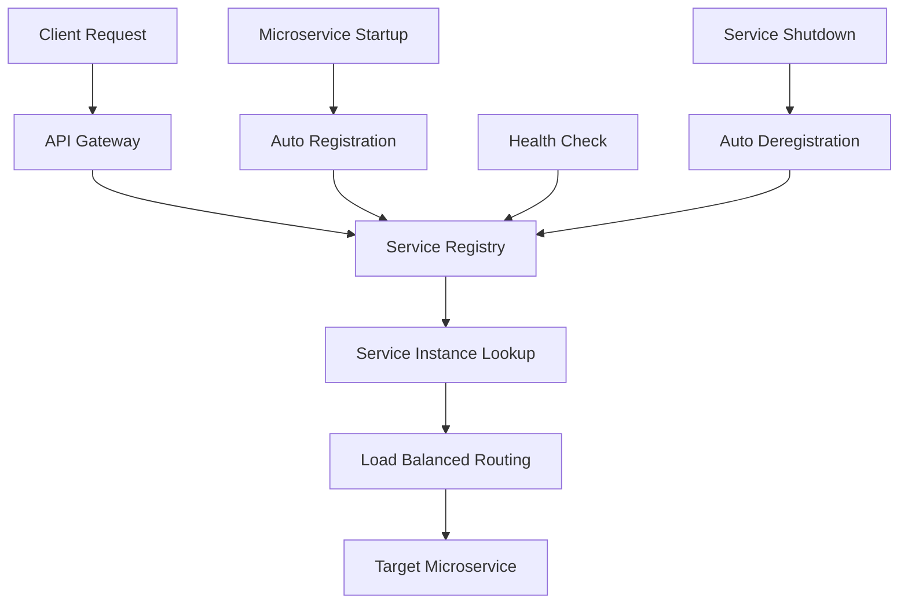

<div align="center">
  <h1>🏛️ ScholarAI Service Registry</h1>
  <p><strong>Netflix Eureka Service Discovery Server</strong></p>
  
  [](https://spring.io/projects/spring-boot)
  [](https://spring.io/projects/spring-cloud)
  [](https://openjdk.org/)
  [](https://github.com/Netflix/eureka)

  <p>Centralized service discovery and registration hub for the ScholarAI microservices ecosystem. Built with Netflix Eureka Server for reliable service management and load balancing.</p>

  [Architecture](#-architecture) · [Quick Start](#-quick-start) · [API Documentation](#-api-endpoints) · [Monitoring](#-monitoring)
</div>

----------------------------------------

## ✨ **Core Features**

### 🔍 **Service Discovery**
- **Automatic Registration**: Microservices automatically register themselves upon startup
- **Health Monitoring**: Continuous health checks with automatic deregistration of unhealthy services
- **Load Balancing**: Client-side load balancing with multiple service instances
- **Fault Tolerance**: Service failover and circuit breaker patterns

### 📊 **Management & Monitoring**
- **Eureka Dashboard**: Web-based UI for service registry visualization
- **Actuator Endpoints**: Health checks, metrics, and operational insights
- **Real-time Status**: Live service instance status and metadata
- **Service Metadata**: Custom metadata support for service configuration

### 🔧 **Production Ready**
- **High Availability**: Multi-zone deployment support
- **Self-Preservation**: Automatic protection against network partitions
- **Containerized**: Docker support with health checks
- **Scalable**: Horizontal scaling with peer-to-peer replication

---------------

## 🚀 **Quick Start**

### Prerequisites
- **Java 21+** (OpenJDK recommended)
- **Maven 3.8+** for building
- **Docker** (optional, for containerized deployment)

### 🛠️ **Local Development**

1. **Clone and Build**
   ```bash
   git clone https://github.com/Solvio-ScholarAI/service-registry.git
   cd service-registry
   ./mvnw clean install
   ```

2. **Run Locally**
   ```bash
   ./mvnw spring-boot:run
   ```
   
   🌐 **Service Registry Dashboard:** `http://localhost:8761`

3. **Verify Installation**
   ```bash
   curl http://localhost:8761/actuator/health
   ```

### 🐳 **Docker Deployment**

#### Using Docker Compose (Recommended)
```bash
# Start service registry
docker-compose up -d

# View logs
docker-compose logs -f service-registry

# Stop service
docker-compose down
```

#### Using Docker Scripts
```bash
# Build and start
./scripts/docker.sh up

# View logs
./scripts/docker.sh logs

# Stop service
./scripts/docker.sh stop

# Health check
./scripts/docker.sh health

# Clean up
./scripts/docker.sh clean
```

#### Manual Docker Commands
```bash
# Build image
docker build -t scholar-service-registry .

# Run container
docker run -d --name scholar-service-registry \
  -p 8761:8761 \
  --network scholarai-network \
  scholar-service-registry
```

---

## 🏗️ **Architecture**

### 📡 **Service Discovery Flow**



### 🔌 **Integration Points**

- **API Gateway**: Service discovery for routing and load balancing
- **User Service**: User management and authentication microservice
- **Project Service**: Academic project and workspace management
- **Notification Service**: Real-time notification delivery
- **Document Service**: PDF and document processing pipeline

### 🛡️ **High Availability Setup**

```yaml
# Production cluster example
eureka:
  server:
    enable-self-preservation: true
    renewal-percent-threshold: 0.85
  client:
    service-url:
      defaultZone: http://eureka1:8761/eureka/,http://eureka2:8761/eureka/
```

---

## 📋 **Configuration**

### 🏠 **Local Development (`application.properties`)**
```properties
spring.application.name=service-registry
server.port=8761
eureka.instance.hostname=localhost
eureka.client.fetch-registry=false
eureka.client.register-with-eureka=false

# Debug logging
logging.level.com.netflix.eureka=DEBUG
logging.level.org.springframework.cloud.netflix.eureka=DEBUG
```

### 🐳 **Docker Environment (`application-docker.properties`)**
```properties
spring.application.name=service-registry
server.port=8761
eureka.instance.hostname=service-registry
eureka.client.fetch-registry=false
eureka.client.register-with-eureka=false

# Management endpoints
management.info.git.mode=full
management.endpoints.web.exposure.include=health,info,prometheus,metrics,eureka
management.endpoint.health.show-details=always
management.endpoint.health.probes.enabled=true
```

### ⚙️ **Advanced Configuration**

```properties
# Self-preservation (production)
eureka.server.enable-self-preservation=true
eureka.server.renewal-percent-threshold=0.85

# Response cache (performance)
eureka.server.response-cache-update-interval-ms=30000
eureka.server.response-cache-auto-expiration-in-seconds=180

# Registry sync (multi-zone)
eureka.server.peer-eureka-nodes-update-interval-ms=10000
eureka.server.number-of-replication-retries=5
```

--------------------------------------------------

## 📊 **API Endpoints**

### 🏥 **Health & Management**

| Endpoint | Method | Description |
|----------|--------|-------------|
| `/actuator/health` | GET | Service health status |
| `/actuator/info` | GET | Application information |
| `/actuator/metrics` | GET | Application metrics |
| `/actuator/eureka` | GET | Eureka-specific metrics |

### 🔍 **Service Registry**

| Endpoint | Method | Description |
|----------|--------|-------------|
| `/eureka/apps` | GET | All registered applications |
| `/eureka/apps/{appName}` | GET | Specific application instances |
| `/eureka/apps/{appName}/{instanceId}` | GET | Specific service instance |
| `/eureka/apps/{appName}/{instanceId}` | POST | Register service instance |
| `/eureka/apps/{appName}/{instanceId}` | DELETE | Deregister service instance |
| `/eureka/apps/{appName}/{instanceId}` | PUT | Send heartbeat |

### 📈 **Examples**

#### Get All Registered Services
```bash
curl -H "Accept: application/json" \
  http://localhost:8761/eureka/apps
```

#### Get Service Instances
```bash
curl -H "Accept: application/json" \
  http://localhost:8761/eureka/apps/USER-SERVICE
```

#### Health Check
```bash
curl http://localhost:8761/actuator/health
```

**Response:**
```json
{
  "status": "UP",
  "components": {
    "diskSpace": {
      "status": "UP",
      "details": {
        "total": 123456789,
        "free": 98765432,
        "threshold": 10485760
      }
    },
    "eureka": {
      "status": "UP",
      "details": {
        "description": "Remote status from Eureka server",
        "applications": {}
      }
    }
  }
}
```

---

## 🎨 **Eureka Dashboard**

### 📱 **Web Interface**
Access the Eureka Dashboard at `http://localhost:8761` to view:

- **Registered Services**: All active microservice instances
- **Instance Status**: Health, metadata, and uptime information  
- **Service URLs**: Direct links to service endpoints
- **Registry Information**: Server configuration and statistics

### 🖼️ **Dashboard Features**
- **Real-time Updates**: Live service registration/deregistration
- **Instance Details**: Hostname, port, status, metadata
- **Health Indicators**: Visual health status with color coding
- **Emergency Mode**: Self-preservation mode activation status

--------------------------

## 🔧 **Development & Testing**

### 🧪 **Running Tests**

```bash
# Unit tests
./mvnw test

# Integration tests
./mvnw verify

# Build with tests
./mvnw clean package
```

### 🐛 **Testing Service Registration**

1. **Start Service Registry**
   ```bash
   ./mvnw spring-boot:run
   ```

2. **Verify Dashboard**
   - Open `http://localhost:8761`
   - Should show "No instances available"

3. **Register a Test Service**
   ```bash
   curl -X POST \
     "http://localhost:8761/eureka/apps/TEST-SERVICE" \
     -H "Content-Type: application/json" \
     -d '{
       "instance": {
         "instanceId": "test-service-001",
         "hostName": "localhost",
         "app": "TEST-SERVICE",
         "ipAddr": "127.0.0.1",
         "port": {"$": 8080, "@enabled": true},
         "status": "UP"
       }
     }'
   ```

4. **Verify Registration**
   - Refresh dashboard to see the test service
   - Check via API: `curl http://localhost:8761/eureka/apps/TEST-SERVICE`

### 📊 **Performance Testing**

```bash
# Load test service registration
for i in {1..10}; do
  curl -X POST "http://localhost:8761/eureka/apps/TEST-SERVICE-$i" \
    -H "Content-Type: application/json" \
    -d "{\"instance\": {\"instanceId\": \"test-$i\", \"app\": \"TEST-SERVICE-$i\", \"status\": \"UP\"}}"
done
```

---

## 🚀 **Production Deployment**

### 🌐 **Multi-Zone Setup**

```yaml
# Zone 1 Configuration
eureka:
  instance:
    metadata-map:
      zone: zone1
  client:
    service-url:
      zone1: http://eureka-zone1:8761/eureka/
      zone2: http://eureka-zone2:8761/eureka/
    availability-zones:
      region1: zone1,zone2
```

### 🔒 **Security Configuration**

```properties
# Enable security (add spring-boot-starter-security)
spring.security.user.name=eureka
spring.security.user.password=${EUREKA_PASSWORD:changeme}
spring.security.user.roles=USER

# SSL/TLS (production)
server.ssl.enabled=true
server.ssl.key-store=/path/to/keystore.p12
server.ssl.key-store-password=${SSL_PASSWORD}
```

### 📊 **Monitoring Integration**

```yaml
# Prometheus metrics
management:
  endpoints:
    web:
      exposure:
        include: health,info,prometheus,metrics
  metrics:
    export:
      prometheus:
        enabled: true
    tags:
      application: ${spring.application.name}
      environment: ${ENV:local}
```

---

## 🔍 **Troubleshooting**

### 🚨 **Common Issues**

#### Service Not Registering
```bash
# Check network connectivity
curl -v http://service-registry:8761/eureka/apps

# Verify service configuration
grep -r "eureka.client.service-url" src/main/resources/
```

#### Self-Preservation Mode
```bash
# Check if activated
curl http://localhost:8761/eureka/status

# Disable for development
eureka.server.enable-self-preservation=false
```

#### Memory Issues
```bash
# Increase heap size
JAVA_OPTS="-Xms512m -Xmx1024m"

# Monitor memory usage
curl http://localhost:8761/actuator/metrics/jvm.memory.used
```

### 📋 **Health Check Failures**

```bash
# Docker container health
docker inspect scholar-service-registry --format='{{.State.Health.Status}}'

# Application health
curl -f http://localhost:8761/actuator/health || echo "Health check failed"

# Detailed health info
curl http://localhost:8761/actuator/health?include=details
```

---

## 🤝 **Contributing**

### 🚀 **Development Setup**
1. Fork the repository
2. Create a feature branch (`git checkout -b feature/amazing-feature`)
3. Make your changes and add tests
4. Run the test suite (`./mvnw test`)
5. Commit your changes (`git commit -m 'Add amazing feature'`)
6. Push to the branch (`git push origin feature/amazing-feature`)
7. Open a Pull Request

### 📋 **Coding Standards**
- Follow Spring Boot conventions
- Use meaningful commit messages
- Add tests for new features
- Update documentation for significant changes
- Ensure all tests pass before submitting PR

### 🐛 **Reporting Issues**
- Use the GitHub issue tracker
- Provide detailed reproduction steps
- Include logs and stack traces
- Specify Java version and environment details

---

## 📄 **License**

This project is licensed under the **MIT License** - see the [LICENSE.md](LICENSE.md) file for details.

---

## 🙏 **Acknowledgments**

- **Netflix** for the open-source Eureka service discovery platform
- **Spring Cloud Team** for the excellent Spring Cloud Netflix integration
- **Spring Boot Team** for the comprehensive framework
- **Community Contributors** for feedback and improvements

------------

<div align="center">
  <p><strong>Built with ☕ for the ScholarAI microservices ecosystem</strong></p>
  <p>
    <a href="http://localhost:8761">Dashboard</a> •
    <a href="http://localhost:8761/actuator">Actuator</a> •
    <a href="https://github.com/Javafest2025/service-registry/issues">Support</a> •
    <a href="https://spring.io/projects/spring-cloud-netflix">Documentation</a>
  </p>
</div>
